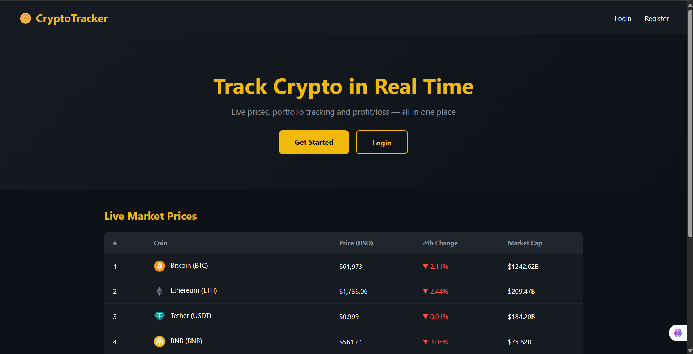
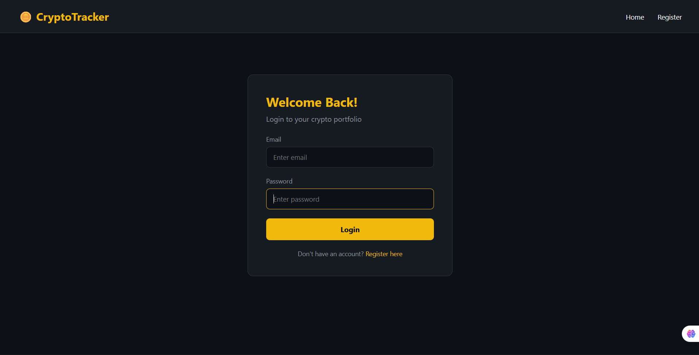
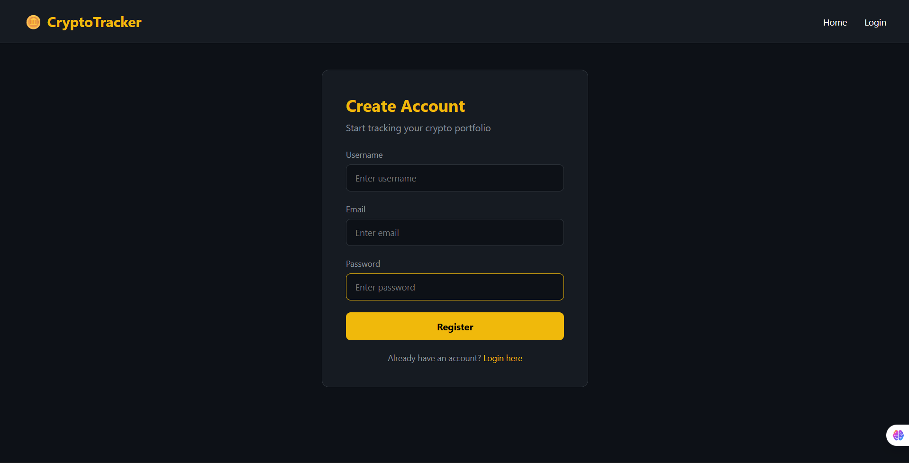
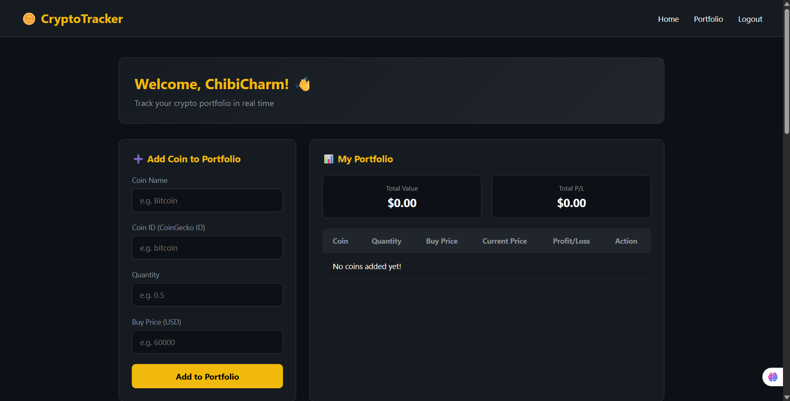
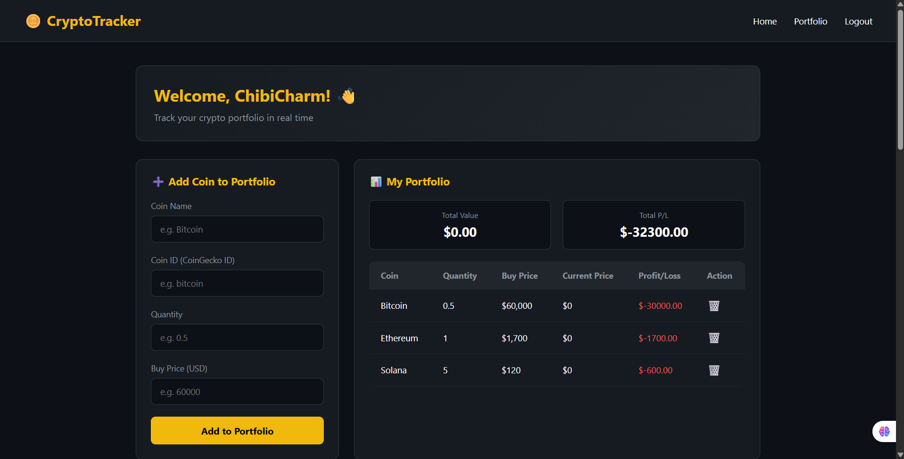
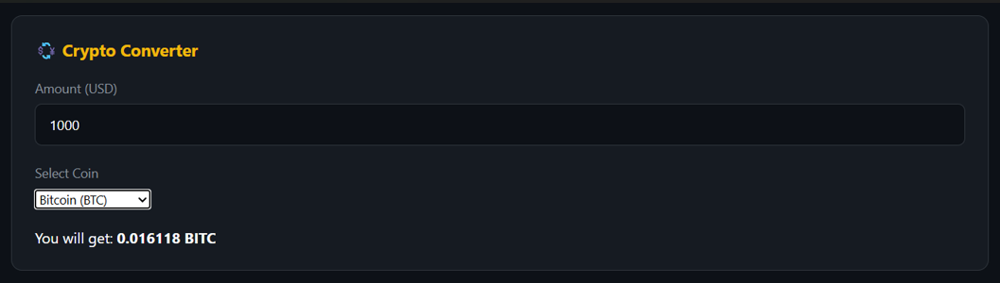

# 🚀 CryptoTracker

A modern cryptocurrency portfolio tracker built using **Flask, MySQL, HTML, CSS, JavaScript, and the CoinGecko API**. The application allows users to securely manage their crypto portfolio, track live market prices, analyze historical trends, convert currencies, and monitor market sentiment through the Crypto Fear & Greed Index.

## 🌐 Live Demo

🔗 https://crypto-tracker-1-qqfz.onrender.com/

---

## ✨ Features

- 🔐 User Registration & Login Authentication
- 📈 Live Cryptocurrency Market Prices
- 💼 Personal Portfolio Management
- 💰 Real-Time Profit/Loss Calculation
- 📊 Interactive 7-Day Price History Charts
- 💱 Cryptocurrency Currency Converter
- 😱 Crypto Fear & Greed Index
- 📱 Responsive Dark-Themed User Interface
- 🗄️ MySQL Database Integration
- ⚡ Real-Time Data from CoinGecko API

---

## 🛠️ Tech Stack

### Frontend
- HTML5
- CSS3
- JavaScript
- Bootstrap

### Backend
- Python
- Flask

### Database
- MySQL

### APIs
- CoinGecko API
- Alternative.me Fear & Greed API

### Deployment
- Render

---

## 📸 Screenshots

### 🏠 Home Page


### 🔐 Login Page


### 📝 Register Page


### 📊 Portfolio Dashboard


### 💼 Portfolio


### 📈 7-Day Price History


### 💱 Crypto Converter


### 😱 Crypto Fear & Greed Index


## 📂 Project Structure

```
crypto-tracker/
│
├── static/
│   ├── css/
│   ├── js/
│   ├── images/
│
├── templates/
│
├── screenshots/
│   ├── home.png
│   ├── login.png
│   ├── register.png
│   ├── dashboard.png
│   ├── graph.png
│   ├── converter.png
│   └── fear-greed.png
│
├── app.py
├── requirements.txt
├── README.md
└── Procfile
```

---

## ⚙️ Installation

### Clone the repository

```bash
git clone https://github.com/VaibhaviLokesh/crypto-tracker.git
```

### Navigate into the project

```bash
cd crypto-tracker
```

### Create a virtual environment

```bash
python -m venv venv
```

### Activate the environment

Windows

```bash
venv\Scripts\activate
```

Mac/Linux

```bash
source venv/bin/activate
```

### Install dependencies

```bash
pip install -r requirements.txt
```

### Configure MySQL

Create a MySQL database and update your database credentials inside **app.py**.

### Run the application

```bash
python app.py
```

Open your browser and visit

```
http://127.0.0.1:5000/
```

---

## 📋 Requirements

- Python 3.10+
- Flask
- MySQL
- requests
- Chart.js
- CoinGecko API

Install everything using

```bash
pip install -r requirements.txt
```

---

## 🚀 Future Enhancements

- 📱 Mobile Responsive Dashboard
- ⭐ Favorite Coins
- 🔔 Price Alerts
- 🌙 Multiple Themes
- 📊 Advanced Portfolio Analytics
- 📈 Candlestick Charts
- 🔐 Google Authentication
- 📤 Export Portfolio to Excel/PDF

---

## 🎯 Learning Outcomes

This project helped in learning:

- Flask Web Development
- REST API Integration
- MySQL Database Operations
- User Authentication
- CRUD Operations
- Data Visualization
- Frontend Development
- Deployment using Render
- Git & GitHub Version Control

---

## 👩‍💻 Author

**Vaibhavi Lokesh**

Electrical & Electronics Engineering Student

Interested in
- Software Development
- Full Stack Development
- Python
- IoT
- AI & Machine Learning

GitHub:
https://github.com/VaibhaviLokesh

---

## ⭐ Support

If you found this project helpful, consider giving it a ⭐ on GitHub!

```

---

## 📌 Before uploading, do these 3 things:

1. Create a folder named **`screenshots`** in your repository.
2. Rename your images exactly as:
   - `home.png`
   - `login.png`
   - `register.png`
   - `dashboard.png`
   - `graph.png`
   - `converter.png`
   - `fear-greed.png`
3. Commit and push the changes.

This README is polished enough to look professional for internship and placement applications and showcases your project clearly.
